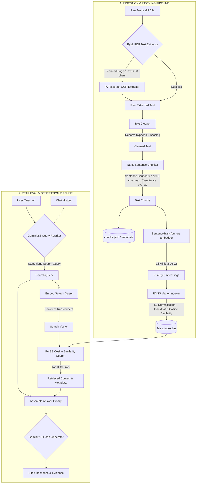

# 🩺 Medical RAG AI Assistant
p
An advanced **Retrieval-Augmented Generation (RAG)** application specialized in medical literature. This system enables intelligent, conversational question-answering over a local medical knowledge base (currently containing literature on **Diabetes, Hypertension, and Obesity**). It is built with a Streamlit interface, local vector search via FAISS, sentence-transformer embeddings, and Gemini 2.5 Flash for state-of-the-art response generation and context-aware query rewriting.

---

## 🗺️ System Architecture & Pipeline Flow

The system operates across two main pipelines: the **Ingestion & Indexing Pipeline** (which processes PDFs into searchable vectors) and the **Retrieval & Generation Pipeline** (which rewrites queries, retrieves relevant contexts, and generates medical answers with citations).



---

## 🌟 Key Features

*   **Intelligent PDF Ingestion & OCR Fallback:** Automatically parses PDF documents page-by-page. If a page contains scanned images or minimal text (under 30 characters), the pipeline falls back to **Tesseract OCR** to extract the text.
*   **Semantic Cleaning & Sentence-Boundary Chunking:** Resolves broken line endings (e.g., `indi-vidual` to `individual`) and standardizes spacing. Uses NLTK's sentence tokenizer to chunk text into overlapping pieces, preserving medical terms and sentence-level context.
*   **Local High-Performance Vector Database:** Converts chunks to dense 384-dimensional vectors using `all-MiniLM-L6-v2` (SentenceTransformers) and indexes them using CPU-accelerated `FAISS` with cosine similarity (L2 normalized Inner Product).
*   **Multi-Turn Conversational Query Rewriting:** Rewrites pronouns and references (like *"What are its symptoms?"* or *"How do they treat that disease?"*) based on previous chat history into standalone search queries.
*   **Dynamic Document Uploading & Hot-Indexing:** Through the Streamlit Sidebar, users can upload new PDFs on-the-fly, assign them to a topic (or create a new one), and trigger immediate text extraction, cleaning, chunking, embedding, and incremental indexing to FAISS—all updated instantly in-memory and on-disk without full rebuilds.
*   **Cited, Grounded LLM Responses:** Under the hood, Gemini 2.5 Flash is heavily constrained via prompt engineering to answer **only** using the retrieved FAISS chunks. If the answer isn't present, it returns a standardized "insufficient information" response, preventing hallucinations. Sources (source document, page number, and topic) are cited clearly.
*   **Interactive Evidence Inspection:** Users can expand a collapsible section in the Streamlit UI to inspect the raw matched text chunks and distances from the vector database, promoting data transparency.

---

## 📁 Project Structure

```text
├── app/
│   ├── __init__.py
│   └── streamlit_app.py          # Streamlit UI (chat, upload sidebar, stats, config)
├── data/
│   ├── diabetes/                  # Raw PDF documents on Diabetes
│   ├── hypertension/              # Raw PDF documents on Hypertension
│   ├── obesity/                   # Raw PDF documents on Obesity
│   └── processed/                 # Output directory for processed data & vector store
│       ├── chunks.json            # Parsed chunk text and metadata index
│       ├── cleaned_documents.json # Intermediate cleaned documents
│       ├── embeddings.npy         # Saved numpy arrays of text embeddings
│       ├── extracted_documents.json # Raw extracted page text
│       └── faiss_index.bin        # Compiled FAISS index binary file
├── embeddings/
│   ├── __init__.py
│   └── embedder.py                # Text embedder class using sentence-transformers
├── ingestion/
│   ├── __init__.py
│   ├── chunker.py                 # Sentence-boundary text chunker (NLTK-based)
│   ├── cleaner.py                 # Extracted text normalization and hyphen joining
│   └── pdf_loader.py              # PyMuPDF text loader and PyTesseract OCR module
├── llm/
│   ├── __init__.py
│   ├── client.py                  # Google GenAI SDK client initializer
│   ├── generator.py               # Answer generation using Gemini 2.5 Flash
│   ├── prompts.py                 # System and instruction templates for LLM tasks
│   └── question_rewriter.py       # Conversational question rewriter
├── retrieval/
│   ├── __init__.py
│   └── retriever.py               # Vector search component querying the FAISS index
├── services/
│   ├── __init__.py
│   ├── document_processor.py      # End-to-end extraction/indexing pipeline for single documents
│   ├── rag_pipeline.py            # Cohesive RAG orchestration layer (Retrieve -> Generate)
│   └── upload_service.py          # Handles UI file saves and calls DocumentProcessor
├── requirements.txt               # Project dependency package declarations
├── test_rag.py                    # Interactive command-line chat script
└── .gitignore                     # Git-ignored folders (virtualenv, cache, secrets)
```

---

## ⚙️ Prerequisites & Setup

### 1. System Requirements

*   **Python:** Version `3.9` to `3.11` (Recommended)
*   **Tesseract OCR Engine:** (Required for PDF pages that are scanned or containing image-only text)
    *   **macOS (via Homebrew):**
        ```bash
        brew install tesseract
        ```
    *   **Ubuntu/Debian (via apt):**
        ```bash
        sudo apt-get update
        sudo apt-get install tesseract-ocr
        ```
    *   **Windows:** Download the installer from UB Mannheim [GitHub repository](https://github.com/UB-Mannheim/tesseract/wiki) and ensure the executable is added to your system `PATH`.

### 2. Virtual Environment Setup

Clone the repository and set up a Python virtual environment:

```bash
# Clone the repository
git clone https://github.com/yourusername/medical-rag.git
cd medical-rag

# Create virtual environment
python -m venv venv

# Activate virtual environment
# On macOS/Linux:
source venv/bin/activate
# On Windows (cmd):
venv\Scripts\activate
# On Windows (PowerShell):
.\venv\Scripts\activate
```

### 3. Install Dependencies

Install the required Python packages:

```bash
pip install --upgrade pip
pip install -r requirements.txt
```

### 4. Configure Environment Variables

Create a `.env` file in the root directory of the project and insert your Google Gemini API Key:

```env
GOOGLE_API_KEY=your_actual_gemini_api_key_here
```

To obtain a Google Gemini API key, visit the [Google AI Studio Console](https://aistudio.google.com/).

---

## 📦 Data Bootstrapping (Optional Step)

The project includes pre-processed datasets ready to be run out-of-the-box in `data/processed/`. However, if you want to regenerate the vector index or clear existing data to run the ingestion pipeline from scratch on your local PDFs, follow these steps in order:

```bash
# 1. Extract text (and run OCR if needed) from PDFs in data/ topic folders
python ingestion/pdf_loader.py

# 2. Standardize and clean the extracted text
python ingestion/cleaner.py

# 3. Chunk the cleaned text into overlapping segments using NLTK
python ingestion/chunker.py

# 4. Generate embeddings using SentenceTransformers
python embeddings/embedder.py

# 5. Build and save the FAISS vector index
python vectorstore/build_index.py
```

---

## 🚀 Running the Applications

The project provides two interfaces for querying the knowledge base:

### 1. Command Line Interface (CLI)

Run an interactive, continuous prompt chat loop directly in your terminal. This is great for rapid query testing and viewing raw outputs:

```bash
python test_rag.py
```

*Example CLI session:*
```text
Pipeline Loaded Successfully

Question: What are the main risk factors for type 2 diabetes?

ANSWER
The main risk factors for type 2 diabetes include genetic predisposition (family history), obesity, physical inactivity, advancing age, and specific high-risk ethnic groups. Lifestyle choices and environmental factors play a highly significant role in the clinical manifestation of the disease.

SOURCES
diabetes_1.pdf (Page 4)
diabetes_3.pdf (Page 12)
```

### 2. Streamlit Web Application (GUI)

Launch the full-featured, visually rich medical dashboard. It includes conversation history, live knowledge base metrics, and document upload capabilities:

```bash
streamlit run app/streamlit_app.py
```

Once running, open your web browser and navigate to the local URL displayed (usually `http://localhost:8501`).

#### Streamlit UI Highlights:
*   **💬 Chat Window:** Full multi-turn dialogue with collapsible tabs displaying **Interpreted Question** (showing Gemini's rewritten search query) and **🔍 Retrieved Evidence** (listing matched paragraphs from documents with page numbers).
*   **📥 PDF Upload Portal:** Drag-and-drop any medical PDF, choose an existing category or create a new one, and index it dynamically. The metrics on the sidebar (Documents, Chunks, Topics list) will update instantly.
*   **🛠️ Tech Stack Inspection:** View current backend settings directly on the UI sidebar.

---

## 🔬 Implementation Highlights

### Semantic Text Chunking
Standard RAG pipelines split text arbitrarily by character length, which often cuts medical terms or logical sentences in half. This project uses `nltk.sent_tokenize` to isolate complete sentences. Chunks are generated dynamically by appending sentences until the chunk size gets as close to `800` characters as possible without exceeding it. For continuity, a sliding window preserves a `2-sentence overlap` between adjacent chunks.

### Mathematical Cosine Similarity Indexing
FAISS uses inner product indexes (`IndexFlatIP`) for maximum retrieval speed. Because inner products correspond directly to cosine similarity when vectors are unit-normalized, the pipeline normalizes the 384-dimensional sentence embeddings using L2 normalization during both indexing and retrieval:
```python
# From build_index.py / retriever.py
embeddings = embeddings.astype("float32")
faiss.normalize_L2(embeddings)
index = faiss.IndexFlatIP(embeddings.shape[1])
index.add(embeddings)
```
This guarantees mathematical cosine similarity mapping which ensures higher quality relevance rankings.

### Context-Aware Query Rewriting
When users speak naturally, they refer to previous nouns using pronouns. For example:
1. *Query 1:* "What is insulin resistance?"
2. *Query 2:* "How does it develop?"

The `Rewriter` module feeds the latest query along with the last 6 turns of conversation history into Gemini 2.5 Flash, which synthesizes a standalone question (e.g., *"How does insulin resistance develop?"*). This standalone question is then embedded to perform highly accurate vector searches, avoiding search failures caused by abstract pronouns.

---

## ⚠️ Disclaimer

**Educational and Research Purpose Only.** This Medical RAG AI Assistant is designed as an educational prototype of a retrieval-augmented generation pipeline. It is not intended to provide professional medical advice, clinical diagnosis, or treatment recommendations. Always consult a qualified healthcare provider for any medical concerns.
